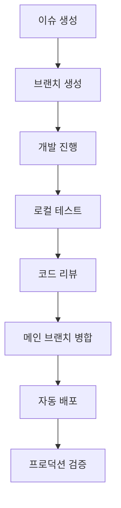

# 개발 워크플로우

이 문서는 뉴스있슈 프로젝트의 개발 프로세스와 워크플로우를 설명합니다.

## 🏗️ 개발 환경 설정

### 필요 도구

**기본 환경:**
- Node.js 18.x LTS
- Python 3.11+
- Git 2.34+
- VS Code (권장 IDE)

**패키지 매니저:**
- npm (Node.js 패키지 관리)
- pip (Python 패키지 관리)

### 로컬 환경 구성

**1. 저장소 클론**
```bash
git clone https://github.com/aebonlee/streamlit_04.git
cd streamlit_04
```

**2. 백엔드 설정**
```bash
cd backend
pip install -r requirements.txt
python init_db.py
```

**3. 프론트엔드 설정**
```bash
cd frontend/news-app
npm install --legacy-peer-deps
```

**4. 환경 변수 설정**
```bash
# backend/.env
OPENAI_API_KEY=sk-your-api-key-here
DB_PATH=news.db

# frontend/news-app/.env.development
VITE_API_URL=http://localhost:8000
```

## 🔄 개발 서버 실행

### 병렬 개발 환경

**터미널 1: 백엔드 서버**
```bash
cd backend
uvicorn main:app --reload --port 8000
```

**터미널 2: 프론트엔드 서버**
```bash
cd frontend/news-app
npm run dev
```

**접속 URL:**
- 프론트엔드: http://localhost:5173
- 백엔드 API: http://localhost:8000
- API 문서: http://localhost:8000/docs

### 개발 도구 활용

**Hot Reload 기능:**
- FastAPI: `--reload` 플래그로 코드 변경 시 자동 재시작
- Vite: 파일 변경 감지 후 즉시 브라우저 업데이트

**디버깅 도구:**
- Browser DevTools: React DevTools 확장 프로그램
- FastAPI: 자동 생성된 Swagger UI (/docs)
- 데이터베이스: SQLite Browser 또는 VS Code 확장

## 🎯 개발 프로세스

### 기능 개발 워크플로우



### Git 브랜치 전략

**브랜치 명명 규칙:**
```bash
feature/article-search       # 새로운 기능
bugfix/favorite-button       # 버그 수정
hotfix/critical-api-error    # 긴급 수정
refactor/component-structure # 리팩토링
```

**개발 프로세스:**
```bash
# 1. 새 기능 브랜치 생성
git checkout -b feature/keyword-analysis

# 2. 개발 및 커밋
git add .
git commit -m "feat: add keyword frequency analysis"

# 3. 원격 저장소 푸시
git push origin feature/keyword-analysis

# 4. Pull Request 생성 (GitHub)
# 5. 코드 리뷰 및 승인
# 6. 메인 브랜치 병합
```

### 커밋 메시지 규약

**Conventional Commits 사용:**
```bash
feat: 새로운 기능 추가
fix: 버그 수정
docs: 문서 업데이트
style: 코드 스타일 변경
refactor: 코드 리팩토링
test: 테스트 추가/수정
chore: 기타 작업
```

**예시:**
```bash
feat: add real-time keyword search functionality
fix: resolve article card layout issue on mobile
docs: update API documentation for favorites endpoint
refactor: optimize database query performance
```

## 🧪 테스팅 전략

### 프론트엔드 테스트

**단위 테스트 (Jest + React Testing Library):**
```bash
cd frontend/news-app
npm test
```

**컴포넌트 테스트 예시:**
```typescript
// ArticleCard.test.tsx
import { render, screen, fireEvent } from '@testing-library/react';
import { ArticleCard } from './ArticleCard';

test('should toggle favorite on click', () => {
  const mockArticle = {
    id: 1,
    title: 'Test Article',
    // ... other properties
  };
  const mockToggle = jest.fn();
  
  render(<ArticleCard article={mockArticle} onToggleFavorite={mockToggle} />);
  
  const favoriteButton = screen.getByRole('button', { name: /favorite/i });
  fireEvent.click(favoriteButton);
  
  expect(mockToggle).toHaveBeenCalledWith(mockArticle);
});
```

### 백엔드 테스트

**API 테스트 (pytest + FastAPI TestClient):**
```bash
cd backend
pytest tests/
```

**API 테스트 예시:**
```python
# test_api.py
from fastapi.testclient import TestClient
from main import app

client = TestClient(app)

def test_get_articles():
    response = client.get("/api/articles")
    assert response.status_code == 200
    data = response.json()
    assert isinstance(data, list)

def test_add_favorite():
    response = client.post("/api/favorites/add", json={"article_id": 1})
    assert response.status_code == 200
    assert response.json()["success"] == True
```

### 통합 테스트

**E2E 테스트 (Playwright):**
```typescript
// tests/e2e/app.spec.ts
import { test, expect } from '@playwright/test';

test('should load articles and allow search', async ({ page }) => {
  await page.goto('http://localhost:5173');
  
  // 기사 목록 로딩 확인
  await expect(page.locator('[data-testid="article-list"]')).toBeVisible();
  
  // 검색 기능 테스트
  await page.fill('[data-testid="search-input"]', 'AI');
  await page.click('[data-testid="search-button"]');
  
  // 검색 결과 확인
  await expect(page.locator('[data-testid="article-card"]')).toBeVisible();
});
```

## 📊 코드 품질 관리

### ESLint 설정

**프론트엔드 (.eslintrc.json):**
```json
{
  "extends": [
    "eslint:recommended",
    "@typescript-eslint/recommended",
    "plugin:react/recommended",
    "plugin:react-hooks/recommended"
  ],
  "rules": {
    "react/react-in-jsx-scope": "off",
    "@typescript-eslint/no-unused-vars": "error",
    "prefer-const": "error"
  }
}
```

### Prettier 설정

**코드 포맷팅 (.prettierrc):**
```json
{
  "semi": true,
  "trailingComma": "es5",
  "singleQuote": true,
  "printWidth": 80,
  "tabWidth": 2
}
```

### 타입 체크

**TypeScript 엄격 모드:**
```json
// tsconfig.json
{
  "compilerOptions": {
    "strict": true,
    "noUnusedLocals": true,
    "noUnusedParameters": true,
    "noImplicitReturns": true
  }
}
```

## 🔧 개발 도구 및 확장

### VS Code 권장 확장

**필수 확장:**
- ES7+ React/Redux/React-Native snippets
- TypeScript Importer
- Prettier - Code formatter
- ESLint
- Python
- SQLite Viewer

**설정 (.vscode/settings.json):**
```json
{
  "editor.formatOnSave": true,
  "editor.codeActionsOnSave": {
    "source.fixAll.eslint": true
  },
  "typescript.preferences.importModuleSpecifier": "relative",
  "python.defaultInterpreterPath": "./venv/bin/python"
}
```

### 개발 스크립트

**package.json 스크립트:**
```json
{
  "scripts": {
    "dev": "vite",
    "build": "tsc && vite build",
    "preview": "vite preview",
    "lint": "eslint src --ext ts,tsx",
    "lint:fix": "eslint src --ext ts,tsx --fix",
    "test": "vitest",
    "test:ui": "vitest --ui"
  }
}
```

**유틸리티 스크립트:**
```bash
# scripts/dev-setup.sh
#!/bin/bash
echo "Setting up development environment..."

# 백엔드 환경 설정
cd backend
python -m venv venv
source venv/bin/activate
pip install -r requirements.txt

# 프론트엔드 환경 설정
cd ../frontend/news-app
npm install --legacy-peer-deps

echo "Development environment ready!"
```

## 🐛 디버깅 가이드

### 일반적인 문제 해결

**1. CORS 에러**
```typescript
// 개발 환경에서 프록시 설정
// vite.config.ts
export default defineConfig({
  server: {
    proxy: {
      '/api': 'http://localhost:8000'
    }
  }
});
```

**2. 의존성 충돌**
```bash
# 캐시 정리 후 재설치
npm cache clean --force
rm -rf node_modules package-lock.json
npm install --legacy-peer-deps
```

**3. 데이터베이스 연결 실패**
```python
# 데이터베이스 파일 권한 확인
import os
import sqlite3

def check_db_connection():
    try:
        conn = sqlite3.connect('news.db')
        cursor = conn.cursor()
        cursor.execute('SELECT 1')
        print("Database connection successful")
    except Exception as e:
        print(f"Database error: {e}")
```

### 성능 프로파일링

**프론트엔드 성능 측정:**
```typescript
// 렌더링 성능 측정
import { Profiler } from 'react';

function onRenderCallback(id, phase, actualDuration, baseDuration, startTime, commitTime) {
  console.log('Component:', id, 'Phase:', phase, 'Duration:', actualDuration);
}

<Profiler id="ArticleList" onRender={onRenderCallback}>
  <ArticleList />
</Profiler>
```

**백엔드 성능 측정:**
```python
import time
import functools

def measure_time(func):
    @functools.wraps(func)
    async def wrapper(*args, **kwargs):
        start_time = time.time()
        result = await func(*args, **kwargs)
        end_time = time.time()
        print(f"{func.__name__} took {end_time - start_time:.2f} seconds")
        return result
    return wrapper

@measure_time
async def get_articles():
    # API 로직
    pass
```

## 📈 개발 메트릭스

### 코드 품질 지표

**측정 항목:**
- 코드 커버리지: >80%
- TypeScript 엄격 모드: 100% 적용
- ESLint 규칙 준수: 0개 경고
- 번들 크기: <1MB (gzipped)

**도구:**
```bash
# 코드 커버리지
npm run test -- --coverage

# 번들 분석
npm run build
npx vite-bundle-analyzer dist
```

### 개발 생산성 지표

**추적 메트릭스:**
- 평균 빌드 시간: <30초
- Hot Reload 속도: <1초
- API 응답 시간: <500ms
- 개발 서버 시작 시간: <10초

## 🚀 배포 준비

### 프로덕션 빌드

**최적화된 빌드:**
```bash
# 프론트엔드
cd frontend/news-app
npm run build

# 빌드 결과 확인
npm run preview
```

**환경별 설정:**
```bash
# 개발 환경
VITE_API_URL=http://localhost:8000

# 프로덕션 환경  
VITE_API_URL=https://streamlit-04.onrender.com
```

### 배포 전 체크리스트

- [ ] 모든 테스트 통과
- [ ] ESLint/Prettier 규칙 준수
- [ ] TypeScript 컴파일 오류 없음
- [ ] 번들 크기 최적화 확인
- [ ] 환경 변수 설정 완료
- [ ] API 엔드포인트 연결 테스트
- [ ] 브라우저 호환성 테스트

---

**다음**: [프로젝트 문서 홈](../README.md)